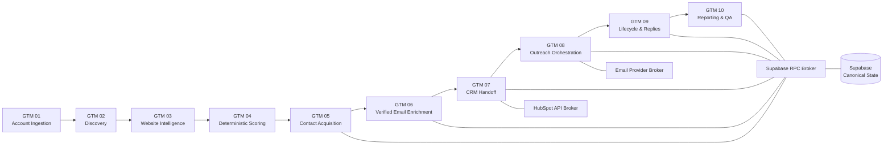

# GTM ICP Intelligence Engine

**An auditable account-to-outreach control plane for B2B GTM workflows.**

This project demonstrates a production-style GTM Engineering system that moves accounts through:

**discovery → website intelligence → deterministic scoring → contact acquisition → identity resolution → verified enrichment → CRM synchronization → controlled outreach → lifecycle handling → reporting & QA**

The objective was not to build another linear automation. The objective was to build a system with explicit contracts, provider abstraction, idempotency, auditability, retry semantics, suppression controls, and human approval gates.

> **Current state:** validated pre-send pilot. Live outbound remains intentionally disabled.

## What the pilot validated

| Metric | Validated state |
|---|---:|
| Scored accounts | 39 |
| Fully measured pilot accounts | 5 |
| Canonical decision-maker contacts | 7 |
| Identity aliases | 28 |
| Verified email contacts | 7 |
| HubSpot mappings | 7 |
| Planned outreach tasks | 7 |
| Real outreach attempts | 0 |
| Provider message IDs | 0 |
| Active suppressions | 0 |
| SMTP2GO live sending | Disabled |

The final baseline passed the full audit under `QA-V1.0.0` and `FINAL-AUDIT-V1.0.0` in state `PRE_SEND_CONTROLLED`.

## Architecture

## Engineering principles

- **Supabase is canonical.** CRM and provider systems are adapters, not the source of truth.
- **Provider calls are auditable attempts.** Once a real provider call occurs, the attempt cannot be erased or silently reset.
- **Idempotency is designed into task keys, payload hashes, run keys, CRM mappings, and event ingestion.**
- **Contact identity is conservative.** Provider ID → LinkedIn → verified email → account-scoped fallback.
- **Verified email only.** Mobile enrichment is intentionally disabled.
- **Outreach is fail-closed.** Eligibility, suppression, approval, and provider-live checks happen immediately before dispatch.
- **Human approval remains part of the system.**
- **Retries preserve history.** A 429/5xx becomes retryable; it does not become “as if the call never happened.”
- **Public artifacts are sanitized.**

## Repository map

- `docs/` — architecture, contracts, testing, failure recovery, full case study
- `workflows/` — sanitized reference exports
- `evidence/` — public baseline and validation matrix
- `portfolio/` — resume bullets, interview talking points, Loom script
- `screenshots/` — redaction/publishing plan
- `scripts/prepublish_scan.py` — simple public-repo secret scan

## Workflow status

This bundle includes sanitized reference exports for the complete canonical workflow set:

- **GTM01–GTM10**
- **Supabase RPC Broker V3 FINAL**
- **HubSpot API Broker V2**
- **SMTP2GO Email Broker V1**

These are intentionally sanitized portfolio references rather than drop-in production exports.

## Tech stack

n8n · Supabase/Postgres · HubSpot · Prospeo · SMTP2GO · HTTP APIs · deterministic scoring · provider abstraction · audit ledgers · idempotency contracts

## Why this project matters

Most GTM automations optimize for “did the workflow run?”

This system instead asks whether the account was eligible, why the contact was selected, whether a provider credit was spent, whether a CRM write already happened, whether outreach is still safe, and whether the system can prove what happened after partial failure.

That is the distinction between a workflow and a GTM control plane.
