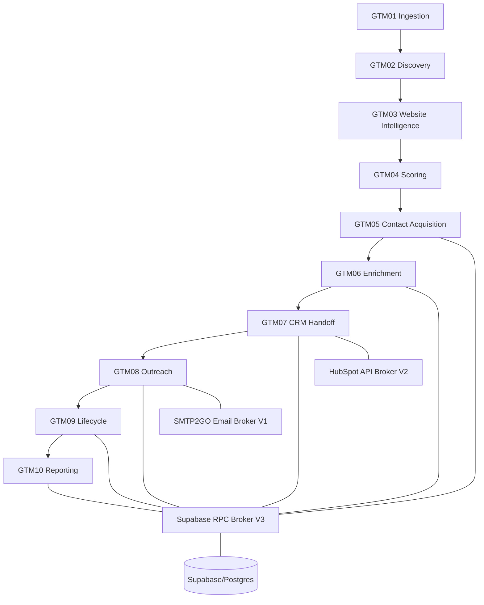

# Architecture

The system has three layers: canonical state in Supabase/Postgres, orchestration in n8n, and external providers behind bounded adapters.

## Control gates

- Account eligibility requires complete intelligence/scoring state.
- Persona classification fails closed for excluded roles.
- Canonical identity prefers provider ID, then LinkedIn, verified email, then account-scoped fallback.
- Enrichment permits verified email only; mobile is disabled.
- CRM uses CREATE/UPDATE/NOOP planning and stable mappings.
- Dispatch requires fresh eligibility, no suppression, approved message, claimable task, and live provider.
- Provider calls are immutable attempts for audit purposes.
